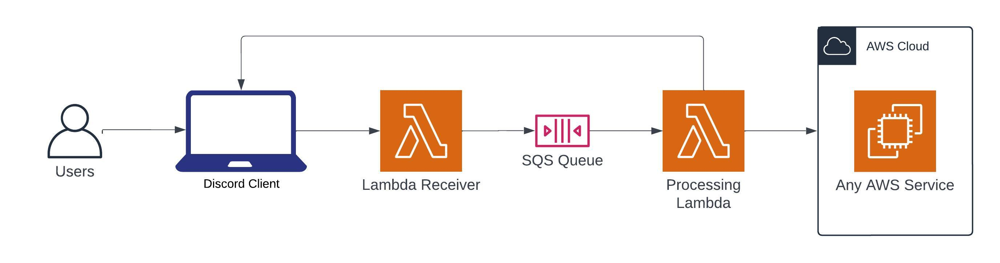

# BotFactory

This project is aimed towards improving and simplifying the creation of Discord bots. It provides an easy-to-use 
interface to make bots that only requires the creation of a bot in the Discord UI and an AWS Account. This is how 
it works:

Essentially, after deployment, a user would send the bot command using the Discord client. The command will be received
by a Lambda function that forwards the command to an SQS queue. This is required because the Discord API has a 2-second
timeout. Then, a processing lambda will take the message, preform longer and heavier operations using AWS services, and
return the results to the client if needed.

## Usage

Each bot requires:

* An entry [here](bin/bot-factory.ts), where:
  * `botName`: The name of the bot.
  * `processingStackClassName`: The name of the CDL stack that contains the processing Lambda and infrastructure.
  * `processingStackClassFile`: The location of the file where the stack is relative to `lib/`.
  * `hostedZoneId`: The ID of the hosted zone in Route53 whre the receiver Lambda can be reached.
  * `zoneName`: The name of the hosted zone in Route53 whre the receiver Lambda can be reached.
* A CDK stack that deploys the processing Lambda and other infrastructure in `lib`.
* A Python Lambda handler in `src/processing_lambdas`.
* A Python Lambda handler in `src/command_updates` to update the Discord commands on deployment.

In addition to the hosted zone as a pre-existing resource, you will need a secret in Secrets Manager with the
name `bot/YOUR_BOT_NAME`, and it must contain the following attributes (which you can get from the Discord UI):
* `PublicKey`
* `Token`
* `ApplicationId`

## Example Bot

In [here](bin/bot-factory.ts), we have the Watchdog2 bot. It was created as an aid to contact players of the
DRGN alliance in the game Star Trek Fleet command. The game has a mechanic in which a player can be attacked
and the resources in their station stolen (ie, raiding). If someone sees a raid happening, they can just send
a raid alert to the user.

It has 2 commands:
* `update2`: It allows the user to enter their phone number. It gets saved in a AWS DynamoDB table.
* `raid2`: It will call and text the respective user using AWS Pinpoint.
